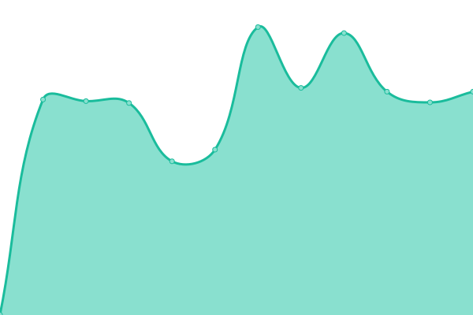
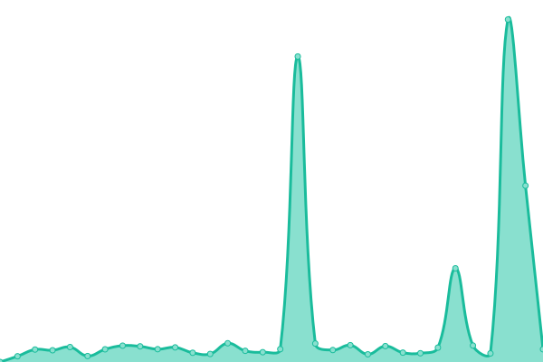
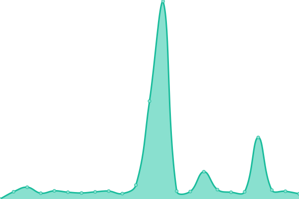
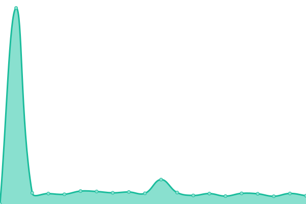
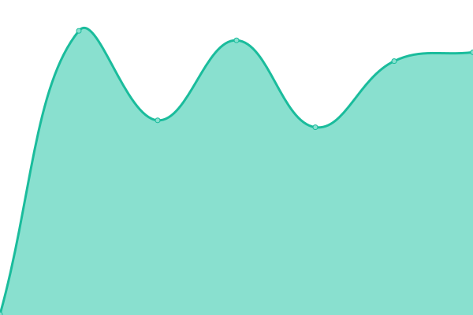
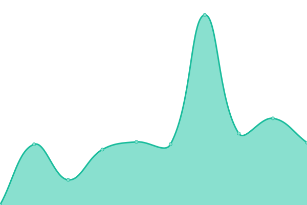
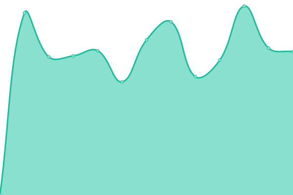
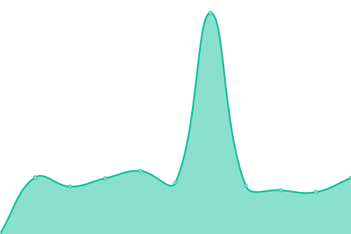
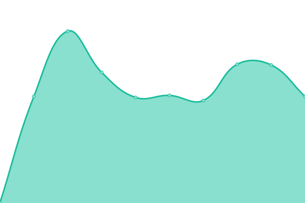

# [📈 Live Status](https://status.fractava.com): <!--live status--> **🟧 Partial outage**

This repository contains the open-source uptime monitor and status page for [FRACTAVA](https://fractava.com), powered by [Upptime](https://github.com/upptime/upptime).

With [Upptime](https://upptime.js.org), you can get your own unlimited and free uptime monitor and status page, powered entirely by a GitHub repository. We use [Issues](https://github.com/fractava/status/issues) as incident reports, [Actions](https://github.com/fractava/status/actions) as uptime monitors, and [Pages](https://status.fractava.com) for the status page.

<!--start: status pages-->
<!-- This summary is generated by Upptime (https://github.com/upptime/upptime) -->
<!-- Do not edit this manually, your changes will be overwritten -->
<!-- prettier-ignore -->
| URL | Status | History | Response Time | Uptime |
| --- | ------ | ------- | ------------- | ------ |
|  [Aptitron (Server)](http://aptitron.fractava.com/) | 🟥 Down | [aptitron-server.yml](https://github.com/fractava/status/commits/HEAD/history/aptitron-server.yml) | 

 0ms
     
 | 

<a href="https://status.fractava.com/history/aptitron-server">0.00%</a>
    

|  [Website Backend](https://backend.fractava.com) | 🟥 Down | [website-backend.yml](https://github.com/fractava/status/commits/HEAD/history/website-backend.yml) | 

 0ms
     
 | 

<a href="https://status.fractava.com/history/website-backend">0.00%</a>
    

|  [Greenytron (Server)](http://cloud.fractava.com/) | 🟩 Up | [greenytron-server.yml](https://github.com/fractava/status/commits/HEAD/history/greenytron-server.yml) | 

 667ms
     
 | 

<a href="https://status.fractava.com/history/greenytron-server">100.00%</a>
    

|  [Nextcloud](https://nextcloud.fractava.com/status.php) | 🟩 Up | [nextcloud.yml](https://github.com/fractava/status/commits/HEAD/history/nextcloud.yml) | 

 933ms
     
 | 

<a href="https://status.fractava.com/history/nextcloud">100.00%</a>
    

|  [Onlyoffice](https://onlyoffice.cloud.fractava.com/) | 🟥 Down | [onlyoffice.yml](https://github.com/fractava/status/commits/HEAD/history/onlyoffice.yml) | 

 430ms
     
 | 

<a href="https://status.fractava.com/history/onlyoffice">0.00%</a>
    

|  [Overleaf](https://overleaf.treffler.cloud/) | 🟩 Up | [overleaf.yml](https://github.com/fractava/status/commits/HEAD/history/overleaf.yml) | 

 680ms
     
 | 

<a href="https://status.fractava.com/history/overleaf">100.00%</a>
    

|  [Website](https://fractava.com) | 🟥 Down | [website.yml](https://github.com/fractava/status/commits/HEAD/history/website.yml) | 

 409ms
     
 | 

<a href="https://status.fractava.com/history/website">0.00%</a>
    

|  [BirdsiteLive](https://birdsitelive.treffler.cloud/) | 🟥 Down | [birdsite-live.yml](https://github.com/fractava/status/commits/HEAD/history/birdsite-live.yml) | 

 0ms
     
 | 

<a href="https://status.fractava.com/history/birdsite-live">0.00%</a>
    

|  [Invidious](https://invidious.treffler.cloud/) | 🟩 Up | [invidious.yml](https://github.com/fractava/status/commits/HEAD/history/invidious.yml) | 

 841ms
     
 | 

<a href="https://status.fractava.com/history/invidious">100.00%</a>
    

|  [Piped](https://piped.treffler.cloud/) | 🟩 Up | [piped.yml](https://github.com/fractava/status/commits/HEAD/history/piped.yml) | 

 120ms
     
 | 

<a href="https://status.fractava.com/history/piped">100.00%</a>
    

|  [Libreddit](https://libreddit.treffler.cloud/) | 🟥 Down | [libreddit.yml](https://github.com/fractava/status/commits/HEAD/history/libreddit.yml) | 

 525ms
     
 | 

<a href="https://status.fractava.com/history/libreddit">0.00%</a>
    

|  [Bibliogram](https://bibliogram.treffler.cloud/) | 🟥 Down | [bibliogram.yml](https://github.com/fractava/status/commits/HEAD/history/bibliogram.yml) | 

 509ms
     
 | 

<a href="https://status.fractava.com/history/bibliogram">0.00%</a>
    

|  [Nitter](https://nitter.treffler.cloud/) | 🟥 Down | [nitter.yml](https://github.com/fractava/status/commits/HEAD/history/nitter.yml) | 

 542ms
     
 | 

<a href="https://status.fractava.com/history/nitter">0.00%</a>
    

|  [Searx](https://searx.treffler.cloud/) | 🟥 Down | [searx.yml](https://github.com/fractava/status/commits/HEAD/history/searx.yml) | 

 539ms
     
 | 

<a href="https://status.fractava.com/history/searx">0.00%</a>
    

|  [CubeS (Server)](http://status.macbrayne.de/) | 🟩 Up | [cube-s-server.yml](https://github.com/fractava/status/commits/HEAD/history/cube-s-server.yml) | 

 388ms
     
 | 

<a href="https://status.fractava.com/history/cube-s-server">100.00%</a>
    

<!--end: status pages-->

[**Visit our status website →**](https://status.fractava.com)

## 📄 License

- Powered by: [Upptime](https://github.com/upptime/upptime)
- Code: [MIT](./LICENSE) © [FRACTAVA](https://fractava.com)
- Data in the `./history` directory: [Open Database License](https://opendatacommons.org/licenses/odbl/1-0/)
